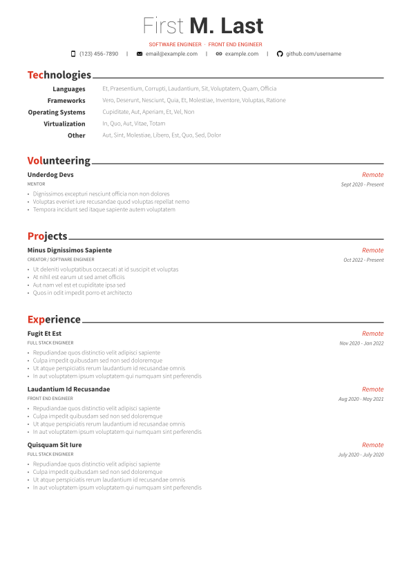

> [!WARNING]
> This currently generates incorrect characters in the PDF copy due to a potential issue in react-pdf, I will look into removing dependency on react-pdf and generating the pdf via puppeteer to solve this. Avoid usage, for now.
# Awesome CV React

This is highly inspired by [Awesome-CV](https://github.com/posquit0/Awesome-CV). It's my attempt at a React clone with an easier config via YAML, simpler styling via CSS, simpler layout with JSX, and easier dependency management via npm.

## Preview

You can see [PDF](preview/resume.pdf)

# Getting Started

This project was bootstrapped with [Create React App](https://github.com/facebook/create-react-app).

# Configuration

All of the config is found in `details.yaml` in the root directory. It's fairly self explanatory, feel free to hit me up if you have any questions.

# Available Scripts

In the project directory, you can run:

### `npm run build`

Builds your `resume.pdf` to the `build` folder. It utilizes [@react-pdf/renderer](https://github.com/diegomura/react-pdf) to render the JSX into a `.pdf`.

## `npm run dev`

Runs a nodemon watch script that watches for changes and rebuilds your `cv.pdf`.

## Work In Progress

There are many features supported by awesome-cv that are yet to be supported in this, including Honors & Awards, Certifications, and Education, as well as the cover letter.

I hope to work on these in the near future.
